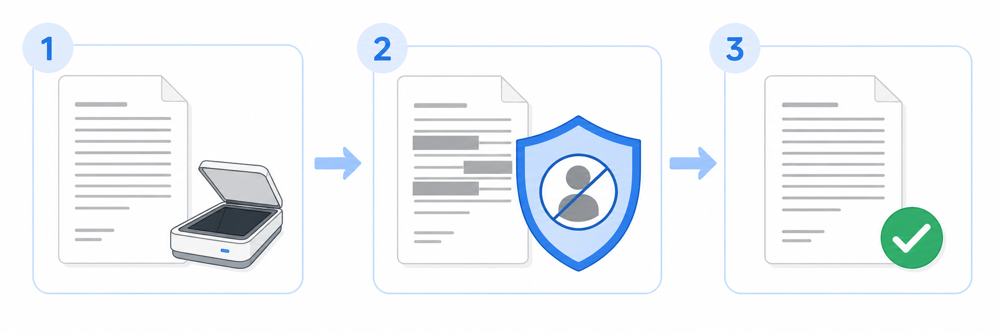

# Medical Deid

Medical Deid turns a scanned medical document into a reviewable PDF in which patient-identifying data has been replaced. OCR, identifier detection, document reconstruction, and validation run on the same computer as the application. The source document is not sent to an external OCR or LLM service.



This repository contains an MVP. Its output requires human review before it is shared or submitted to another system. A successful run does not certify that a document is anonymous or satisfy an institution's legal and clinical review obligations.

## What the application does

For each document, Medical Deid:

1. renders every source page as an image;
2. uses Surya OCR to recover text blocks and their page coordinates;
3. combines deterministic detectors with a local Qwen model to propose patient identifiers;
4. accepts only replacements that match exact OCR text;
5. masks replaced text, barcodes, and QR codes, then reconstructs a searchable PDF;
6. checks that replaced source text is absent from the exported PDF text layer.

If OCR, model output, replacement matching, or export validation fails, the application produces no downloadable result.

The current identifier categories include patient and relative names, dates of birth, addresses, phone numbers, email addresses, government and insurance identifiers, medical-record identifiers, workplaces, and other identifying text. When the document date can be established, a date of birth is replaced with the patient's age on that date. If the date cannot be verified, processing stops instead of calculating an age from the current date.

## Why processing stays local

The source page, OCR text, model prompt, detected identifiers, and change log can all contain protected information. The desktop application therefore communicates with its Python worker over stdin/stdout and opens no local HTTP port. The browser version uses a localhost API for development only.

The application does use the network on first setup to download the selected Qwen model, the Surya OCR files, and the matching `llama.cpp` runtime. Every downloaded asset is checked against its expected size and SHA-256 digest before processing is enabled. Document contents are not part of those requests.

Only a reviewed de-identified result should leave the controlled computer. Do not deploy the localhost browser adapter or upload original medical documents to a remote service until authentication, jurisdiction, retention, and deletion have been designed for that deployment.

## Supported document formats

| Input | How it is handled | Output |
| --- | --- | --- |
| `.jpg`, `.jpeg` | One image becomes one document page. EXIF orientation is applied. | Searchable PDF |
| `.png` | One image becomes one document page. | Searchable PDF |
| `.pdf` | Every page is rendered and processed, including scanned PDFs and PDFs with a text layer. | Reconstructed searchable PDF |

The maximum input size is 25 MiB. DOCX, TIFF, HEIC, DICOM, CSV, and directories of documents are not accepted by the application.

The original file is never modified. The application keeps a local session copy, intermediate OCR and model artifacts, a protected `change-log.json`, and the resulting `anonymized.pdf`.

## Choose how to run it

| Mode | Intended use | Processing boundary |
| --- | --- | --- |
| Installed Windows or macOS application | Normal document processing | Local Tauri application and packaged Python worker; no server or terminal |
| Local browser | UI and API development | Vite on `127.0.0.1:5173` and FastAPI on `127.0.0.1:8000` |
| Native application from source | Desktop integration and packaging work | Vite plus Tauri and the packaged worker sidecar |
| Corpus command | Maintainer evaluation over a directory of test documents | Local Python pipeline; writes an inspectable result directory |

### Run an installed desktop application

The current native targets are:

- Windows x64: NSIS `.exe` installer;
- Apple Silicon macOS: `.app` inside an unsigned `.dmg`.

Open the installer or disk image, install Medical Deid, and start it from the Start menu or Applications folder. Python, Node.js, Rust, Docker, and a terminal are not required on the user's computer.

On first launch:

1. choose a model profile;
2. click **Скачать** and wait until every asset has been verified;
3. click **Выбрать документ** and choose a PDF, JPG, JPEG, or PNG file;
4. wait for the session to show **Готово**;
5. click **Сохранить обезличенный PDF** and review the file before use.

The application chooses Apple Metal on Apple Silicon. On Windows it chooses CUDA when `nvidia-smi` detects an NVIDIA driver and otherwise installs the CPU runtime.

| Profile | Qwen download | Minimum RAM checked by the app | Minimum free disk checked by the app |
| --- | ---: | ---: | ---: |
| Qwen3 4B Q4_K_M | 2.3 GiB | 8 GiB | 6 GiB |
| Qwen3 8B Q4_K_M | 4.7 GiB | 16 GiB | 10 GiB |
| Qwen3 30B-A3B Q4_K_M | 17.3 GiB | 32 GiB | 28 GiB |

The disk requirement also leaves room for about 1.4 GiB of OCR files, the runtime, and working data. A smaller model is easier to run, but model size is not evidence that its de-identification quality is sufficient.

### Run the local browser version

Use this mode to develop the shared React interface and FastAPI adapter. It is not a production web deployment.

Prerequisites:

- Python 3.12 or 3.13;
- [`uv`](https://docs.astral.sh/uv/);
- Node.js 22 with npm;
- Apple Silicon macOS or Windows x64 for an installable local inference runtime.

Install the dependencies from the repository root:

```bash
uv sync --locked --group dev
npm ci --prefix apps/ui
```

Start the local API in one terminal:

```bash
uv run python scripts/run_greenfield_web.py
```

Start the interface in a second terminal:

```bash
npm --prefix apps/ui run dev
```

Open <http://127.0.0.1:5173>. The interface downloads and verifies the same model assets as the desktop application.

Set `MEDICAL_DEID_DATA_DIR` before starting the API to keep models and sessions in a specific directory. The local adapter listens on `127.0.0.1:8000`; the Vite proxy sends browser requests to that address.

### Run the native application from source

In addition to the browser prerequisites, install stable Rust and the native build prerequisites for Tauri v2. Install both JavaScript workspaces:

```bash
uv sync --locked --group dev
npm ci --prefix apps/ui
npm ci --prefix apps/desktop
```

Build the worker for the current platform.

Apple Silicon macOS:

```bash
uv run python scripts/build_desktop_worker.py --target aarch64-apple-darwin --clean
```

Windows x64:

```powershell
uv run python scripts/build_desktop_worker.py --target x86_64-pc-windows-msvc --clean
```

Start Vite in one terminal:

```bash
npm --prefix apps/ui run dev
```

Start Tauri in a second terminal:

```bash
npm --prefix apps/desktop run tauri dev
```

Tauri opens the shared interface and starts `medical-deid-worker` as a hidden sidecar. Requests and responses use newline-delimited JSON over stdin/stdout.

### Build native installers

Build each installer on its target operating system. A macOS build is not a substitute for a Windows build.

After building the worker and installing both npm workspaces as shown above, run:

```bash
npm --prefix apps/ui run build
npm --prefix apps/desktop run tauri build
```

Tauri writes bundles under `apps/desktop/src-tauri/target/release/bundle/`. The GitHub Actions workflow [`.github/workflows/desktop-build.yml`](.github/workflows/desktop-build.yml) builds and uploads separate `windows-x64` and `macos-arm64` artifacts.

The macOS DMG is currently unsigned and may trigger Gatekeeper. Signing and notarization remain release work.

### Process a test corpus from the command line

This command is for repeatable maintainer evaluation, not for ordinary document use. It processes every supported file directly inside one source directory and writes one session directory per document.

The command-line path requires a working local Surya installation, `llama-cli` on `PATH`, and a GGUF model file:

```bash
uv run python scripts/run_corpus.py \
  --source-dir /path/to/synthetic-documents \
  --output-dir /path/to/run-output \
  --llm-model-path /path/to/Qwen3-30B-A3B-Q4_K_M.gguf
```

Each completed session contains `anonymized.pdf`, extracted result text, intermediate work files, and replacement evidence. `manifest.json` records status, elapsed time, page count, and failure reasons for the complete run.

Generate side-by-side page images for human review:

```bash
uv run python scripts/render_review.py --corpus-dir /path/to/run-output
```

Review images are written under each session's `review/` directory.

## Where local data is stored

By default, the desktop application and the local browser adapter store models, session metadata, source copies, intermediate files, change logs, and results in:

- macOS: `~/Library/Application Support/MedicalDeid`;
- Windows: `%LOCALAPPDATA%\MedicalDeid`.

These directories contain protected information. Restrict access, back them up only under an approved data policy, and remove them through the operating system when the test data is no longer needed. The current greenfield interface does not yet provide session deletion.

## Verify a change

Run the Python tests:

```bash
uv run pytest
```

Build the shared interface:

```bash
npm ci --prefix apps/ui
npm --prefix apps/ui run build
```

For desktop changes, also build the worker and native bundle on every affected target. A source build on one operating system does not verify the other platform's installer.

## Repository layout

```text
apps/ui/                 shared React interface
apps/desktop/            Tauri shell and native file dialogs
packages/contract/       TypeScript transport contract
packages/python-core/    model catalog, downloads, checksums, and preflight
packages/desktop-worker/ stdin/stdout adapter used by Tauri
services/web-api/        localhost FastAPI adapter used by the browser
src/medical_deid/        OCR, identifier replacement, reconstruction, and sessions
scripts/                 worker builds, local web startup, and corpus evaluation
tests/                   pipeline, storage, API, and transport tests
```

The implementation and delivery contract is in [`docs/greenfield-desktop-delivery-plan.md`](docs/greenfield-desktop-delivery-plan.md). The earlier product and deployment decisions are recorded in [`docs/design.md`](docs/design.md); treat that document as design history where the current code or delivery plan differs.
